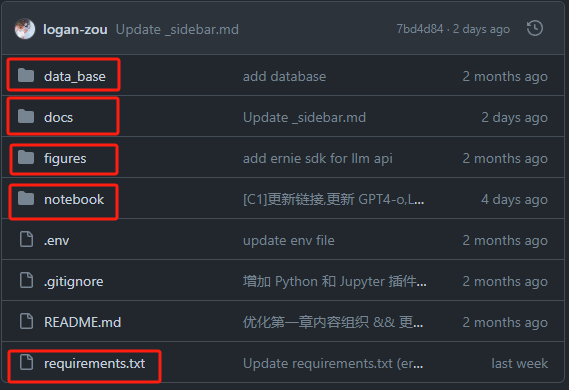
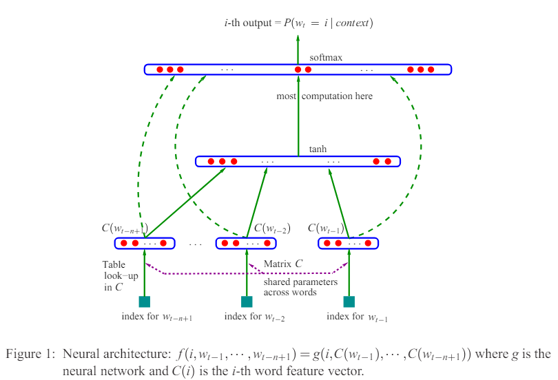
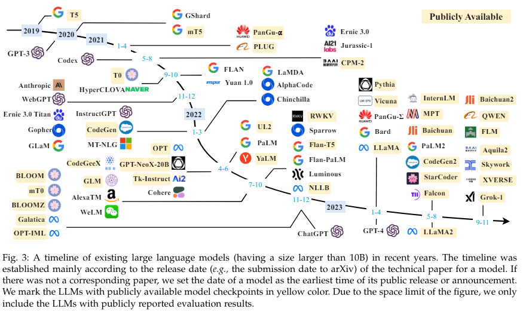
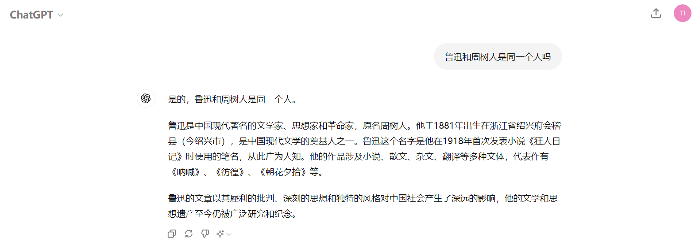

# 手把手一起学大模型应用开发💯(初级版)

***


***

## 第一章 大模型简介

### 学习参考

项目教程：[中文教程](https://datawhalechina.github.io/llm-universe/)

代码仓库：[代码地址](https://github.com/datawhalechina/llm-universe)

<font color="blue">仓库代码目录说明：</font>

>```markup
>  requirements.txt：官方环境下的安装依赖
>  notebook：Notebook 源代码文件
>  docs：Markdown 文档文件
>  figures：图片
>  data_base：所使用的知识库源文件
>```




### 项目简介

本次课程学习主要是面向小白开发者的大模型应用开发学习，旨在基于阿里云服务器，结合个人知识库助手项目，通过一个课程完成大模型开发的重点入门，主要内容包括如下的五部分内容：

1. 大模型简介，何为大模型、大模型特点是什么、LangChain 是什么，如何开发一个 LLM 应用，针对小白开发者的简单介绍；
2. 如何调用大模型 API，本节介绍了国内外知名大模型产品 API 的多种调用方式，包括调用原生 API、封装为 LangChain LLM、封装为 Fastapi 等调用方式，同时将包括百度文心、讯飞星火、智谱AI等多种大模型 API 进行了统一形式封装；
3. 知识库搭建，不同类型知识库文档的加载、处理，向量数据库的搭建；
4. 构建 RAG 应用，包括将 LLM 接入到 LangChain 构建检索问答链，使用 Streamlit 进行应用部署
5. 验证迭代，大模型开发如何实现验证迭代，一般的评估方法有什么；

本项目主要包括三部分内容：

1. LLM 开发入门。V1 版本的简化版，旨在帮助初学者最快、最便捷地入门 LLM 开发，理解 LLM 开发的一般流程，可以搭建出一个简单的 Demo。
2. LLM 开发技巧。LLM 开发更进阶的技巧，包括但不限于：Prompt Engineering、多类型源数据的处理、优化检索、召回精排、Agent 框架等
3. LLM 应用实例。引入一些成功的开源案例，从本课程的角度出发，解析这些应用范例的 Idea、核心思路、实现框架，帮助初学者明白其可以通过 LLM 开发什么样的应用。

### 项目意义

* LLM 正逐步成为信息世界的新革命力量，其通过强大的自然语言理解、自然语言生成能力，为开发者提供了新的、更强大的应用开发选择。随着国内外井喷式的 LLM API 服务开放，如何基于 LLM API 快速、便捷地开发具备更强能力、集成 LLM 的应用，开始成为开发者的一项重要技能。

* 目前，关于 LLM 的介绍以及零散的 LLM 开发技能课程已有不少，但质量参差不齐，且没有很好地整合，开发者需要搜索大量教程并阅读大量相关性不强、必要性较低的内容，才能初步掌握大模型开发的必备技能，学习效率低，学习门槛也较高。

* 本项目从实践出发，结合最常见、通用的个人知识库助手项目，深入浅出逐步拆解 LLM 开发的一般流程、步骤，旨在帮助没有算法基础的小白通过一个课程完成大模型开发的基础入门。同时，我们也会加入 RAG 开发的进阶技巧以及一些成功的 LLM 应用案例的解读，帮助完成第一部分学习的读者进一步掌握更高阶的 RAG 开发技巧，并能够通过对已有成功项目的借鉴开发自己的、好玩的应用。

  ***

## 1.1 LLM大语言模型

### 1.1.1 理论简介

**概念：**大语言模型（LLM，Large Language Model），也称大型语言模型，是一种旨在理解和生成人类语言的人工智能模型。通常包括了**`数百亿（或更多）参数`**的语言模型，在海量的文本数据上进行训练，从而捕获一些深层次的语义理解。目前国内外已经有了很多的模型：

* 国外：

>GPT-3.5、GPT-4、PaLM、Claude、LLaMA，等等

* 国内：

>文心一言、讯飞星火、通义千问、智谱ChatGLM、百川，等等

这些语言模型不论是大语言模型还是小语言模型，都使用了一些相似的架构以及预训练的任务，但是他们所展露出来的解决问题的能力大不相同。例如，GPT-3 和 GPT-2 为例，GPT-3 可以通过学习上下文来解决少样本任务，而 GPT-2 在这方面表现较差。因此，科研界给这些庞大的语言模型起了个名字，称之为“大语言模型（LLM）”。

### 1.1.2 LLM大模型的出现

对语言进行分析的研究最早是从统计学（20世纪90年代）的角度来进行分析，通过分析已经出现的词汇来预测下一个词汇，但是在理解一些更加复杂的语言规则方面，例如在训练和测试过程中词序列的顺序的差异，仍然存在很大的局限性。因此，在2003年研究者**Bengio**发表了一篇经典论文[《A Neural Probabilistic Language Model》](https://dl.acm.org/doi/pdf/10.5555/944919.944966)，首次将深度学习的思想引入了语言模型，具体来说构建了一个三层的神经网络模型来对语言进行建模，如下图所示。




自此之后，基于深度学习的思想逐渐引入了语言模型中，随着[《attention is all you need》](https://arxiv.org/abs/1706.03762)的出现，研究者们发现`Transformer`这种考虑整句中每一个词之间的相互关系可能对于最后的预测效果是非常好的。<font color="blue">注意：对Transformer的细节讲解可以参考我之前的博客——[Transformer_李宏毅_2021]([2021李宏毅机器学习课程-YouTube第四部分、Transformer_李宏毅 transformer 课件-CSDN博客](https://blog.csdn.net/weixin_52836217/article/details/128494330?spm=1001.2014.3001.5501))</font>。此外，研究者还发现随着语言模型规模（参数量/更多数据）的不断扩大，模型展现出了一种非常惊人的能力**涌现能力**，因此引发了人们对于LLM大语言模型一发不可收拾的探索。

### 1.1.3 LLM大模型的发展

常见的大语言模型的发展历程虽然只有短短不到五年的时间，但是发展速度相当惊人，截止 2023 年 6 月，国内外有超过百种大模型相继发布。下图根据参考文章：[A Survey of Large Language Models](https://arxiv.org/abs/2303.18223)按照时间线给出了 2019 年至 2023 年 6 月比较有影响力并且模型参数量超过 100 亿的大语言模型：



根据代码是否开源目前的大语言模型可以分为两大类：**开源**和**闭源**。

#### 一、闭源LLM

##### GPT系列

>体验地址：[ChatGPT](https://chat.openai.com)

最经典但是同时也是名声最大的就是由`OpenAI`公司提出的`GPT系列`，最早是OpenAI公司在2018年提出的GPT (Generative Pre-Training)生成式语言模型，原则上**通过语言建模将世界知识压缩到仅解码器 (decoder-only) 的 Transformer 模型中**，这样它就可以恢复(或记忆)世界知识的语义，并充当通用任务求解器。大致上的研究可以划分为如下的几个阶段：


2022年11月，OpenAI发布了基于GPT模型的会话应用**ChatGPT**（支持GPT-3.5和GPT-4两个版本），本质上来说是一个LLM的应用。

有一个可以直观区分ChatGPT版本的简单方式——Prompt输入为：“鲁迅和周树人是同一个人吗”，回答分别如下：

>* GPT-3.5
>
>


>* GPT-4
>
>

根据官方公布的模型参数量，我们可以对比得出如下的结论：

|         |   模型规模    |                     性能                     | 安全性                     | 二次开发能力                                  |
| :-----: | :-----------: | :------------------------------------------: | -------------------------- | --------------------------------------------- |
| GPT-3.5 |  1750亿参数   |        速度快，但处理复杂任务效果较差        | 容易被诱导输出一些有害信息 | 不能使用插件，二次开发能力有限，且API调用受限 |
|  GPT-4  | 约1.8万亿参数 | 上下文表示能力强，具有更强解决复杂任务的能力 | 难以被诱导，更安全         | 可以自由使用多种插件，二次开发更灵活          |

总体来说，GPT-4由于包含了更多的参数已经在复杂任务的处理上远远超越了GPT-3.5但是，随着模型体积的增加回答的耗时也不可避免的增加了。

##### Claude系列

Claude 系列模型是由 OpenAI 离职人员创建的 **Anthropic** 公司开发的闭源语言大模型。

>体验地址：[Claude](https://claude.ai/chats)

最早的 **Claude** 于 `2023 年 3 月 15 日`发布，在 2023 年 7 月 11 日，更新至 **Claude-2**， 并在 `2024 年 3 月 4 日`更新至 **Claude-3**。

Claude 3 系列包括三个不同的模型，分别是 Claude 3 Haiku、Claude 3 Sonnet 和 Claude 3 Opus，它们的能力依次递增，旨在满足不同用户和应用场景的需求。

##### PaLM/Gemini系列

> 体验地址：[PaLM ](https://ai.google/discover/palm2/)

> 体验地址：[Gemini](https://gemini.google.com/)


**PaLM 系列**语言大模型由 **Google** 开发。其初始版本于 `2022 年 4 月`发布，并在 2023 年 3 月公开了 API。2023 年 5 月，Google 发布了 **PaLM 2**，`2024 年 2 月 1 日`，Google 将 Bard(之前发布的对话应用) 的底层大模型驱动由 PaLM2 更改为 **Gemini**，同时也将原先的 Bard 更名为 **Gemini**。

目前的 Gemini 是第一个版本，即 Gemini 1.0，根据参数量不同分为 Ultra, Pro 和 Nano 三个版本。

##### 文心一言

> 体验地址：[文心一言](https://yiyan.baidu.com)

**文心一言是基于百度文心大模型的知识增强语言大模型**，于 `2023 年 3 月`在国内率先开启邀测。文心一言的基础模型文心大模型于 2019 年发布 1.0 版，现已更新到 **4.0** 版本。更进一步划分，文心大模型包括 NLP 大模型、CV 大模型、跨模态大模型、生物计算大模型、行业大模型。中文能力相对来说非常不错的闭源模型。

文心一言网页版分为**免费版**和**专业版**。

- 免费版使用文心 3.5 版本，已经能够满足个人用户或小型企业的大部分需求。
- 专业版使用文心 4.0 版本。定价为 59.9 元/月，连续包月优惠价为 49.9 元/月

同时也可以使用 API 进行调用（[计费详情](https://console.bce.baidu.com/qianfan/chargemanage/list)）。

##### 星火大模型

> 体验地址：[星火大模型](https://xinghuo.xfyun.cn)

**讯飞星火认知大模型**是**科大讯飞**发布的语言大模型，支持多种自然语言处理任务。该模型于 `2023 年 5 月`首次发布，后续经过多次升级。`2023 年 10 月`，讯飞发布了**讯飞星火认知大模型 V3.0**。`2024 年 1 月`，讯飞发布了**讯飞星火认知大模型 V3.5**，在语言理解，文本生成，知识问答等七个方面进行了升级，并且支持 system 指令，插件调用等多项功能。

#### 二、开源LLM

在浏览了这么多的闭源LLM之后，肯定广大的开发者们并不会只是满足于使用和欣赏他人的成果，下面我们来列出一些常用的开源LLM大模型。

##### LLaMA系列

> 体验地址：[Meta LLaMA ](https://llama.meta.com)

> 开源地址：[LLaMA ](https://github.com/facebookresearch/llama)

LLaMA 系列模型是 **Meta** 开源的一组参数规模 从 **7B **到 **70B** 的基础语言模型。LLaMA 于`2023 年 2 月`发布，2023 年 7 月发布了  LLaMA2 模型，并于 `2024 年 4 月 18 日`发布了 **LLaMA3** 模型。展示了如何仅使用**公开可用的数据集**来训练最先进的模型，而不需要依赖专有或不可访问的数据集。这些数据集包括 `Common Crawl、Wikipedia、OpenWebText2、RealNews、Books` 等。LLaMA 模型使用了**大规模的数据过滤和清洗技术**，以提高数据质量和多样性，减少噪声和偏见。LLaMA 模型还使用了高效的**数据并行**和**流水线并行**技术，以加速模型的训练和扩展。特别地，LLaMA 13B 在 CommonsenseQA 等 9 个基准测试中超过了 GPT-3 (175B)，而 **LLaMA 65B 与最优秀的模型 Chinchilla-70B 和 PaLM-540B 相媲美**。LLaMA 通过使用更少的字符来达到最佳性能，从而在各种推理预算下具有优势。

与 GPT 系列相同，LLaMA 模型也采用了 **decoder-only** 架构，同时结合了一些前人工作的改进：

- Pre-normalization 正则化
- SwiGLU 激活函数
- 旋转位置编码（RoPE，Rotary Position Embedding）

LLaMA3在 LLaMA 系列模型的基础上进行了改进，提高了模型的性能和效率：

- 更多的训练数据量

- 更长的上下文长度

- 分组查询注意力（GQA，Grouped-Query Attention）

- 更大的词表

##### 通义千问

> 体验地址：[通义千问体验](https://tongyi.aliyun.com)

> 开源地址：[通义千问开源](https://github.com/QwenLM/Qwen2)

通义千问由**阿里巴巴基于“通义”大模型研发**，于 `2023 年 4 月`正式发布。2023 年 9 月，阿里云开源了 Qwen（通义千问）系列工作。2024 年 2 月 5 日，开源了 **Qwen1.5**（Qwen2 的测试版）。并于 `2024 年 6 月 6 日`正式开源了 **Qwen2**。 Qwen2 是一个 **decoder-Only** 的模型，采用 `SwiGLU 激活`、`RoPE`、`GQA`的架构。中文能力相对来说非常不错的开源模型。

目前，已经开源了 5 种模型大小：**0.5B、1.5B、7B、72B 的 Dense 模型和 57B (A14B)的 MoE 模型**；所有模型均支持长度为 **32768 token** 的上下文。并将 Qwen2-7B-Instruct 和 Qwen2-72B-Instruct 的上下文长度扩展至 **128K token**。

##### 智谱ChatGLM系列

> 体验地址：[ChatGLM 体验](https://chatglm.cn/)

> 开源地址：[ChatGLM 开源](https://github.com/THUDM/GLM-4)

GLM 系列模型是**清华大学和智谱 AI 等**合作研发的语言大模型。2023 年 3 月 发布了 **ChatGLM**。6 月发布了 **ChatGLM 2**。10 月推出了 **ChatGLM3**。2024 年 1 月 16 日 发布了 **GLM4**，并于 `2024 年 6 月 6 日`正式开源。

**GLM-4-9B-Chat** 支持多轮对话的同时，还具备网页浏览、代码执行、自定义工具调用（Function Call）和长文本推理（支持最大 **128K** 上下文）等功能。

开源了`对话模型` **GLM-4-9B-Chat**、`基础模型` **GLM-4-9B**、`长文本对话模型` **GLM-4-9B-Chat-1M**（支持 1M 上下文长度）、`多模态模型`**GLM-4V-9B** 等全面对标 OpenAI。`2024 年 1 月 16 日` 发布了最新 **ChatGLM4**，但**目前还没有开源**。

##### Baichuan

> 体验地址：[百川体验](https://www.baichuan-ai.com/chat)

> 开源地址：[百川开源](https://github.com/baichuan-inc)

**Baichuan** 是由**百川智能**开发的**开源可商用**的语言大模型。其基于**Transformer 解码器架构（decoder-only）**。

2023 年 6 月 15 日发布了 **Baichuan-7B** 和 **Baichuan-13B**。百川同时开源了**预训练**和**对齐**模型，`预训练模型是面向开发者的“基座”`，而`对齐模型则面向广大需要对话功能的普通用户`。

**Baichuan2** 于 `2023年 9 月 6 日`推出。发布了 **7B、13B** 的 **Base** 和 **Chat** 版本，并提供了 Chat 版本的 **4bits 量化**。

`2024 年 1 月 29 日` 发布了最新 **Baichuan 3**。但是**目前还没有开源**。

## 1.2 LLM大模型的特点

`LLM大语言模型`的能力非常巨大，根据[《周枫：当我们谈论大模型时，应该关注哪些新能力？》](https://xueqiu.com/1389978604/248392718)一文可以总结归纳为一下三种：1、**涌现能力**、2、**作为基座模型支持多元应用的能力**、3、**支持对话作为统一入口的能力**。具体来说：


同时，大语言模型也具有非常多的特点例如：

1. **巨大的规模：** LLM 通常具有巨大的参数规模，可以达到数十亿甚至数千亿个参数。这使得它们能够捕捉更多的语言知识和复杂的语法结构。

2. **预训练和微调：** LLM 采用了预训练和微调的学习方法。首先在大规模文本数据上进行预训练（无标签数据），学习通用的语言表示和知识。然后通过微调（有标签数据）适应特定任务，从而在各种 NLP 任务中表现出色。

3. **上下文感知：** LLM 在处理文本时具有强大的上下文感知能力，能够理解和生成依赖于前文的文本内容。这使得它们在对话、文章生成和情境理解方面表现出色。

4. **多语言支持：** LLM 可以用于多种语言，不仅限于英语。它们的多语言能力使得跨文化和跨语言的应用变得更加容易。

5. **多模态支持：** 一些 LLM 已经扩展到支持多模态数据，包括文本、图像和声音。使得它们可以理解和生成不同媒体类型的内容，实现更多样化的应用。

6. **伦理和风险问题：** 尽管 LLM 具有出色的能力，但它们也引发了伦理和风险问题，包括生成有害内容、隐私问题、认知偏差等。因此，研究和应用 LLM 需要谨慎。

7. **高计算资源需求：** LLM 参数规模庞大，需要大量的计算资源进行训练和推理。通常需要使用高性能的 GPU 或 TPU 集群来实现。

大语言模型是一种具有强大语言处理能力的技术，已经在多个领域展示了潜力。

## 1.3 LLM大模型的影响

LLM大语言模型已经在非常多的领域取得了瞩目的成果，但是伴随着成果的同时也带来了很多的问题与挑战，例如安全问题、伦理问题、模型规模问题等等。因此，研究者们还在努力让大语言模型去更好的训练学习，以提升人机交互的水平。在未来，大语言模型仍然具有非常巨大的研究价值。


