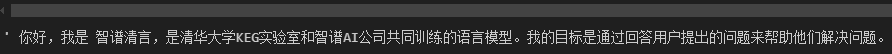
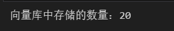
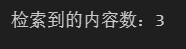
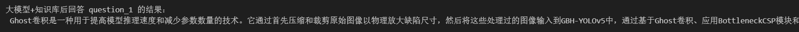
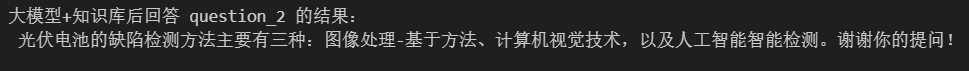
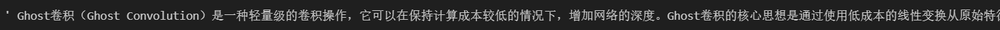
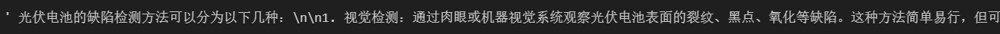
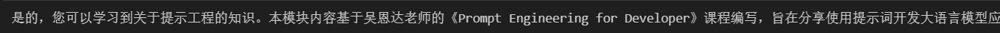
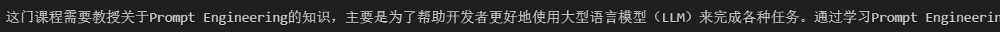
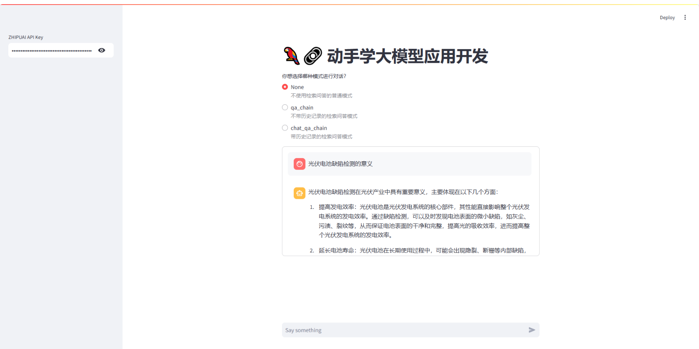

# 手把手一起学大模型应用开发💯(初级版)

***


***

## 学习参考

项目教程：[中文教程](https://datawhalechina.github.io/llm-universe/)

代码仓库：[代码地址](https://github.com/datawhalechina/llm-universe)

<font color="blue">仓库代码目录说明：</font>

>```markup
>requirements.txt：官方环境下的安装依赖
>notebook：Notebook 源代码文件
>docs：Markdown 文档文件
>figures：图片
>data_base：所使用的知识库源文件
>```


## 第四章 构建RAG应用

### 项目简介

本次课程学习主要是面向小白开发者的大模型应用开发学习，旨在基于阿里云服务器，结合个人知识库助手项目，通过一个课程完成大模型开发的重点入门，主要内容包括如下的五部分内容：

1. 大模型简介，何为大模型、大模型特点是什么、LangChain 是什么，如何开发一个 LLM 应用，针对小白开发者的简单介绍；
2. 如何调用大模型 API，本节介绍了国内外知名大模型产品 API 的多种调用方式，包括调用原生 API、封装为 LangChain LLM、封装为 Fastapi 等调用方式，同时将包括百度文心、讯飞星火、智谱AI等多种大模型 API 进行了统一形式封装；
3. 知识库搭建，不同类型知识库文档的加载、处理，向量数据库的搭建；
4. 构建 RAG 应用，包括将 LLM 接入到 LangChain 构建检索问答链，使用 Streamlit 进行应用部署
5. 验证迭代，大模型开发如何实现验证迭代，一般的评估方法有什么；

本项目主要包括三部分内容：

1. LLM 开发入门。V1 版本的简化版，旨在帮助初学者最快、最便捷地入门 LLM 开发，理解 LLM 开发的一般流程，可以搭建出一个简单的 Demo。
2. LLM 开发技巧。LLM 开发更进阶的技巧，包括但不限于：Prompt Engineering、多类型源数据的处理、优化检索、召回精排、Agent 框架等
3. LLM 应用实例。引入一些成功的开源案例，从本课程的角度出发，解析这些应用范例的 Idea、核心思路、实现框架，帮助初学者明白其可以通过 LLM 开发什么样的应用。

### 项目意义

* LLM 正逐步成为信息世界的新革命力量，其通过强大的自然语言理解、自然语言生成能力，为开发者提供了新的、更强大的应用开发选择。随着国内外井喷式的 LLM API 服务开放，如何基于 LLM API 快速、便捷地开发具备更强能力、集成 LLM 的应用，开始成为开发者的一项重要技能。
* 目前，关于 LLM 的介绍以及零散的 LLM 开发技能课程已有不少，但质量参差不齐，且没有很好地整合，开发者需要搜索大量教程并阅读大量相关性不强、必要性较低的内容，才能初步掌握大模型开发的必备技能，学习效率低，学习门槛也较高。
* 本项目从实践出发，结合最常见、通用的个人知识库助手项目，深入浅出逐步拆解 LLM 开发的一般流程、步骤，旨在帮助没有算法基础的小白通过一个课程完成大模型开发的基础入门。同时，我们也会加入 RAG 开发的进阶技巧以及一些成功的 LLM 应用案例的解读，帮助完成第一部分学习的读者进一步掌握更高阶的 RAG 开发技巧，并能够通过对已有成功项目的借鉴开发自己的、好玩的应用。

***

## 4.1 LLM接入LangChain

LangChain 为基于 LLM 开发自定义应用提供了高效的开发框架，便于开发者迅速地激发 LLM 的强大能力，搭建 LLM 应用。LangChain 也同样支持多种大模型，内置了 OpenAI、LLAMA 等大模型的调用接口。但是，LangChain 并没有内置所有大模型，它通过允许用户自定义 LLM 类型，来提供强大的可扩展性。更多细节可以查看[Langchain官方文档](https://api.python.langchain.com/en/latest/api_reference.html#module-langchain.chat_models)。

我们同样可以通过 LangChain 框架来调用智谱 AI 大模型，以将其接入到我们的应用框架中。由于 langchain 中提供的[ChatGLM](https://python.langchain.com/docs/integrations/llms/chatglm)已不可用，因此我们需要自定义一个LLM。

本次学习我使用的是智谱 GLM API，需要将我们封装接口的代码调用LangChain。根据智谱官方宣布以下模型即将弃用，在这些模型弃用后，会将它们自动路由至新的模型。请用户注意在弃用日期之前，将您的模型编码更新为最新版本，以确保服务的顺畅过渡，更多模型相关信息请访问[model](https://open.bigmodel.cn/dev/howuse/model)

| 模型编码 |弃用日期|指向模型|
| ---- | ---- | ---- |
|chatglm_pro|2024 年 12 月 31 日|glm-4|
|chatglm_std|2024 年 12 月 31 日|glm-3-turbo|
|chatglm_lite|2024 年 12 月 31 日|glm-3-turbo|

## 4.2 封装代码

封装代码如下所示：

```python
from typing import Any, List, Mapping, Optional, Dict
from langchain_core.callbacks.manager import CallbackManagerForLLMRun
from langchain_core.language_models.llms import LLM
from zhipuai import ZhipuAI

# 继承自 langchain_core.language_models.llms.LLM
class ZhipuAILLM(LLM):
    # 默认选用 glm-4 模型
    model: str = "glm-4"
    # 温度系数
    temperature: float = 0.1
    # API_Key
    api_key: str = None
    
    def _call(self, prompt : str, stop: Optional[List[str]] = None,
                run_manager: Optional[CallbackManagerForLLMRun] = None,
                **kwargs: Any):
        
        def gen_glm_params(prompt):
            '''
            构造 GLM 模型请求参数 messages

            请求参数：
                prompt: 对应的用户提示词
            '''
            messages = [{"role": "user", "content": prompt}]
            return messages
        
        client = ZhipuAI(
            api_key=self.api_key
        )
     
        messages = gen_glm_params(prompt)
        response = client.chat.completions.create(
            model = self.model,
            messages = messages,
            temperature = self.temperature
        )

        if len(response.choices) > 0:
            return response.choices[0].message.content
        return "generate answer error"


    # 首先定义一个返回默认参数的方法
    @property
    def _default_params(self) -> Dict[str, Any]:
        """获取调用Ennie API的默认参数。"""
        normal_params = {
            "temperature": self.temperature,
            }
        # print(type(self.model_kwargs))
        return {**normal_params}

    @property
    def _llm_type(self) -> str:
        return "Zhipu"

    @property
    def _identifying_params(self) -> Mapping[str, Any]:
        """Get the identifying parameters."""
        return {**{"model": self.model}, **self._default_params}
具体使用：

```

```python
from zhipuai_llm import ZhipuAILLM

from dotenv import find_dotenv, load_dotenv
import os

_ = load_dotenv(find_dotenv())

api_key = os.environ["ZHIPUAI_API_KEY"] #填写控制台中获取的 APIKey 信息

zhipuai_model = ZhipuAILLM(model="chatglm_std", temperature=0, api_key=api_key)

zhipuai_model("你好，请你自我介绍一下！")

```

成功！




## 4.3 构建检索问答知识链

这一部分需要基于[任务三]([Datawhale_LLM/notes/Third_Task.md at main · lyc686/Datawhale_LLM (github.com)](https://github.com/lyc686/Datawhale_LLM/blob/main/notes/Third_Task.md))中构建好的本地知识的文档，建立一个向量知识库，然后对query查询问题进行召回，并将召回结果和query结合构建prompt，输入大模型得到回答。

### 4.3.1 构建向量数据库

```python
import sys
# sys.path.append("../C3 搭建知识库") # 将父目录放入系统路径中

# 使用智谱 Embedding API，注意，需要将上一章实现的封装代码下载到本地
from zhipuai_embedding import ZhipuAIEmbeddings

from langchain.vectorstores.chroma import Chroma

from dotenv import load_dotenv, find_dotenv
import os

_ = load_dotenv(find_dotenv())    # read local .env file
zhipuai_api_key = os.environ['ZHIPUAI_API_KEY']

# 定义 Embeddings
embedding = ZhipuAIEmbeddings()

# 向量数据库持久化路径
persist_directory = '../../data_base/vector_db/chroma'

# 加载数据库
vectordb = Chroma(
    persist_directory=persist_directory,  # 允许我们将persist_directory目录保存到磁盘上
    embedding_function=embedding
)

print(f"向量库中存储的数量：{vectordb._collection.count()}")
```



输入一个我们想要查询的内容进行测试：

```python
question = "defect detection"
docs = vectordb.similarity_search(question,k=3)
print(f"检索到的内容数：{len(docs)}")

for i, doc in enumerate(docs):
    print(f"检索到的第{i}个内容: \n {doc.page_content}", end="\n-----------------------------------------------------\n")
```




### 4.3.2 创建LLM构建检索问答链

创建检索 QA 链的方法 RetrievalQA.from_chain_type() 有如下参数：
- llm：指定使用的 LLM
- 指定 chain type : RetrievalQA.from_chain_type(chain_type="map_reduce")，也可以利用load_qa_chain()方法指定chain type。
- 自定义 prompt ：通过在RetrievalQA.from_chain_type()方法中，指定chain_type_kwargs参数，而该参数：chain_type_kwargs = {"prompt": PROMPT}
- 返回源文档：通过RetrievalQA.from_chain_type()方法中指定：return_source_documents=True参数；也可以使用RetrievalQAWithSourceChain()方法，返回源文档的引用（坐标或者叫主键、索引）

```python
import os 
OPENAI_API_KEY = os.environ['ZHIPUAI_API_KEY']

# llm = ChatOpenAI(model_name = "gpt-3.5-turbo", temperature = 0)
llm  = ZhipuAILLM(model="chatglm_std", temperature=0, api_key=api_key)
llm.invoke("请你自我介绍一下自己！")
```


```python
from langchain.prompts import PromptTemplate

template = """使用以下上下文来回答最后的问题。如果你不知道答案，就说你不知道，不要试图编造答
案。最多使用三句话。尽量使答案简明扼要。总是在回答的最后说“谢谢你的提问！”。
{context}
问题: {question}
"""

QA_CHAIN_PROMPT = PromptTemplate(input_variables=["context","question"],
                                 template=template)

from langchain.chains import RetrievalQA

qa_chain = RetrievalQA.from_chain_type(llm,
                                       retriever=vectordb.as_retriever(),
                                       return_source_documents=True,
                                       chain_type_kwargs={"prompt":QA_CHAIN_PROMPT})
```

基于我们的本地知识库的内容构建两个问题:

```python
question_1 = "什么是ghost卷积？"

result = qa_chain({"query": question_1})
print("大模型+知识库后回答 question_1 的结果：")
print(result["result"])
```



```python
question_2 = "光伏电池的缺陷检测方法可以分为哪几种？"

result = qa_chain({"query": question_2})
print("大模型+知识库后回答 question_2 的结果：")
print(result["result"])
```



同时我们也可以单纯的只基于大模型来进行回答：

```python
prompt_template = """请回答下列问题:
                            {}""".format(question_1)

### 基于大模型的问答
llm.predict(prompt_template)
```



```python
prompt_template = """请回答下列问题:
                            {}""".format(question_2)

### 基于大模型的问答
llm.predict(prompt_template)
```



观察发现添加了本地的知识库之后，我们的回答会更加贴近我们期望的结果。

> ⭐ 通过以上两个问题，我们发现 LLM 对于一些近几年的知识以及非常识性的专业问题，回答的并不是很好。而加上我们的本地知识，就可以帮助 LLM 做出更好的回答。另外，也有助于缓解大模型的“幻觉”问题。

### 4.3.3 添加历史对话的记忆功能

现在我们已经实现了通过上传本地知识文档，然后将他们保存到向量知识库，通过将查询问题与向量知识库的召回结果进行结合输入到 LLM 中，我们就得到了一个相比于直接让 LLM 回答要好得多的结果。在与语言模型交互时，你可能已经注意到一个关键问题 - **它们并不记得你之前的交流内容**。这在我们构建一些应用程序（如聊天机器人）的时候，带来了很大的挑战，使得对话似乎缺乏真正的连续性。

#### 一、嵌入记忆

在本节中我们将介绍 LangChain 中的储存模块，即如何将先前的对话嵌入到语言模型中的，使其具有连续对话的能力。我们将使用 `ConversationBufferMemory` ，它保存聊天消息历史记录的列表，这些历史记录将在回答问题时与问题一起传递给聊天机器人，从而将它们添加到上下文中。

```python
from langchain.memory import ConversationBufferMemory

memory = ConversationBufferMemory(
    memory_key="chat_history",  # 与 prompt 的输入变量保持一致。
    return_messages=True  # 将以消息列表的形式返回聊天记录，而不是单个字符串
)
```

关于更多的 Memory 的使用，包括保留指定对话轮数、保存指定 token 数量、保存历史对话的总结摘要等内容，请参考 langchain 的 Memory 部分的相关文档。

#### 二、构建对话检索链

对话检索链（ConversationalRetrievalChain）在检索 QA 链的基础上，增加了处理对话历史的能力。

它的工作流程是:
1. 将之前的对话与新问题合并生成一个完整的查询语句。
2. 在向量数据库中搜索该查询的相关文档。
3. 获取结果后,存储所有答案到对话记忆区。
4. 用户可在 UI 中查看完整的对话流程。

这种链式方式将新问题放在之前对话的语境中进行检索，可以处理依赖历史信息的查询。并保留所有信

息在对话记忆中，方便追踪。

使用上一部分中的向量数据库和 LLM ！首先提出一个无历史对话的问题“这门课会学习到关于提示工程的知识吗？”，并查看回答。

```python
from langchain.chains import ConversationalRetrievalChain

retriever=vectordb.as_retriever()

qa = ConversationalRetrievalChain.from_llm(
    llm,
    retriever=retriever,
    memory=memory
)
question = "我可以学习到关于提示工程的知识吗？"
result = qa({"question": question})
print(result['answer'])
```



然后基于答案对下一个问题进行继续讨论：

```python
question = "为什么这门课需要教这方面的知识？"
result = qa({"question": question})
print(result['answer'])
```



可以看到，LLM 它准确地判断了这方面的知识，指代内容是强化学习的知识，也就

是我们成功地传递给了它历史信息。这种持续学习和关联前后问题的能力，可大大增强问答系统的连续

性和智能水平。

## 4.4 部署知识问答小助手

### 4.4.1 streamlit工具包

Streamlit 是一种快速便捷的方法，可以直接在 **Python 中通过友好的 Web 界面演示机器学习模型**。在本课程中，我们将学习**如何使用它为生成式人工智能应用程序构建用户界面**。在构建了机器学习模型后，如果你想构建一个 demo 给其他人看，也许是为了获得反馈并推动系统的改进，或者只是因为你觉得这个系统很酷，所以想演示一下：Streamlit 可以让您通过 Python 接口程序快速实现这一目标，而无需编写任何前端、网页或 JavaScript 代码。


`Streamlit` 是一个用于快速创建数据应用程序的开源 Python 库。它的设计目标是让数据科学家能够轻松地将数据分析和机器学习模型转化为具有交互性的 Web 应用程序，而无需深入了解 Web 开发。和常规 Web 框架，如 Flask/Django 的不同之处在于，它不需要你去编写任何客户端代码（HTML/CSS/JS），只需要编写普通的 Python 模块，就可以在很短的时间内创建美观并具备高度交互性的界面，从而快速生成数据分析或者机器学习的结果；另一方面，和那些只能通过拖拽生成的工具也不同的是，你仍然具有对代码的完整控制权。

Streamlit 提供了一组简单而强大的基础模块，用于构建数据应用程序：

- st.write()：这是最基本的模块之一，用于在应用程序中呈现文本、图像、表格等内容。

- st.title()、st.header()、st.subheader()：这些模块用于添加标题、子标题和分组标题，以组织应用程序的布局。

- st.text()、st.markdown()：用于添加文本内容，支持 Markdown 语法。

- st.image()：用于添加图像到应用程序中。

- st.dataframe()：用于呈现 Pandas 数据框。

- st.table()：用于呈现简单的数据表格。

- st.pyplot()、st.altair_chart()、st.plotly_chart()：用于呈现 Matplotlib、Altair 或 Plotly 绘制的图表。

- st.selectbox()、st.multiselect()、st.slider()、st.text_input()：用于添加交互式小部件，允许用户在应用程序中进行选择、输入或滑动操作。

- st.button()、st.checkbox()、st.radio()：用于添加按钮、复选框和单选按钮，以触发特定的操作。

这些基础模块使得通过 Streamlit 能够轻松地构建交互式数据应用程序，并且在使用时可以根据需要进行组合和定制，更多内容请查看[官方文档](https://docs.streamlit.io/get-started)


```python
import streamlit as st
from langchain_openai import ChatOpenAI
import os
from langchain_core.output_parsers import StrOutputParser
from langchain.prompts import PromptTemplate
from langchain.chains import RetrievalQA
# import sys
# sys.path.append("../C3 搭建知识库") # 将父目录放入系统路径中
from zhipuai_embedding import ZhipuAIEmbeddings
from langchain.vectorstores.chroma import Chroma
from langchain.memory import ConversationBufferMemory
from langchain.chains import ConversationalRetrievalChain
from dotenv import load_dotenv, find_dotenv
_ = load_dotenv(find_dotenv())    # read local .env file


from typing import Any, List, Mapping, Optional, Dict
from langchain_core.callbacks.manager import CallbackManagerForLLMRun
from langchain_core.language_models.llms import LLM
from zhipuai import ZhipuAI

# 继承自 langchain_core.language_models.llms.LLM
class ZhipuAILLM(LLM):
    # 默认选用 glm-4 模型
    model: str = "glm-4"
    # 温度系数
    temperature: float = 0.1
    # API_Key
    api_key: str = None
    
    def _call(self, prompt : str, stop: Optional[List[str]] = None,
                run_manager: Optional[CallbackManagerForLLMRun] = None,
                **kwargs: Any):
        
        def gen_glm_params(prompt):
            '''
            构造 GLM 模型请求参数 messages

            请求参数：
                prompt: 对应的用户提示词
            '''
            messages = [{"role": "user", "content": prompt}]
            return messages
        
        client = ZhipuAI(
            api_key=self.api_key
        )
     
        messages = gen_glm_params(prompt)
        response = client.chat.completions.create(
            model = self.model,
            messages = messages,
            temperature = self.temperature
        )

        if len(response.choices) > 0:
            return response.choices[0].message.content
        return "generate answer error"


    # 首先定义一个返回默认参数的方法
    @property
    def _default_params(self) -> Dict[str, Any]:
        """获取调用Ennie API的默认参数。"""
        normal_params = {
            "temperature": self.temperature,
            }
        # print(type(self.model_kwargs))
        return {**normal_params}

    @property
    def _llm_type(self) -> str:
        return "Zhipu"

    @property
    def _identifying_params(self) -> Mapping[str, Any]:
        """Get the identifying parameters."""
        return {**{"model": self.model}, **self._default_params}


#export OPENAI_API_KEY=
#os.environ["OPENAI_API_BASE"] = 'https://api.chatgptid.net/v1'
zhipuai_api_key = os.environ['ZHIPUAI_API_KEY']


def generate_response(input_text, zhipuai_api_key):
    llm  = ZhipuAILLM(model="chatglm_std", temperature=0, api_key=zhipuai_api_key)
    output = llm.invoke(input_text)
    output_parser = StrOutputParser()
    output = output_parser.invoke(output)
    #st.info(output)
    return output

def get_vectordb():
    # 定义 Embeddings
    embedding = ZhipuAIEmbeddings()
    # 向量数据库持久化路径
    persist_directory = '../../data_base/vector_db/chroma'
    # 加载数据库
    vectordb = Chroma(
        persist_directory=persist_directory,  # 允许我们将persist_directory目录保存到磁盘上
        embedding_function=embedding
    )
    return vectordb

#带有历史记录的问答链
def get_chat_qa_chain(question:str,zhipuai_api_key:str):
    vectordb = get_vectordb()
    llm  = ZhipuAILLM(model="chatglm_std", temperature=0, api_key=zhipuai_api_key)
    memory = ConversationBufferMemory(
        memory_key="chat_history",  # 与 prompt 的输入变量保持一致。
        return_messages=True  # 将以消息列表的形式返回聊天记录，而不是单个字符串
    )
    retriever=vectordb.as_retriever()
    qa = ConversationalRetrievalChain.from_llm(
        llm,
        retriever=retriever,
        memory=memory
    )
    result = qa({"question": question})
    return result['answer']

#不带历史记录的问答链
def get_qa_chain(question:str,zhipuai_api_key:str):
    vectordb = get_vectordb()
    llm  = ZhipuAILLM(model="chatglm_std", temperature=0, api_key=zhipuai_api_key)
    template = """使用以下上下文来回答最后的问题。如果你不知道答案，就说你不知道，不要试图编造答
        案。最多使用三句话。尽量使答案简明扼要。总是在回答的最后说“谢谢你的提问！”。
        {context}
        问题: {question}
        """
    QA_CHAIN_PROMPT = PromptTemplate(input_variables=["context","question"],
                                 template=template)
    qa_chain = RetrievalQA.from_chain_type(llm,
                                       retriever=vectordb.as_retriever(),
                                       return_source_documents=True,
                                       chain_type_kwargs={"prompt":QA_CHAIN_PROMPT})
    result = qa_chain({"query": question})
    return result["result"]


# Streamlit 应用程序界面
def main():
    st.title('🦜🔗 动手学大模型应用开发')
    api_key = st.sidebar.text_input('ZHIPUAI API Key', type='password')

    # 添加一个选择按钮来选择不同的模型
    #selected_method = st.sidebar.selectbox("选择模式", ["qa_chain", "chat_qa_chain", "None"])
    selected_method = st.radio(
        "你想选择哪种模式进行对话？",
        ["None", "qa_chain", "chat_qa_chain"],
        captions = ["不使用检索问答的普通模式", "不带历史记录的检索问答模式", "带历史记录的检索问答模式"])

    # 用于跟踪对话历史
    if 'messages' not in st.session_state:
        st.session_state.messages = []

    messages = st.container(height=300)
    if prompt := st.chat_input("Say something"):
        # 将用户输入添加到对话历史中
        st.session_state.messages.append({"role": "user", "text": prompt})

        if selected_method == "None":
            # 调用 respond 函数获取回答
            answer = generate_response(prompt, api_key)
        elif selected_method == "qa_chain":
            answer = get_qa_chain(prompt,api_key)
        elif selected_method == "chat_qa_chain":
            answer = get_chat_qa_chain(prompt,api_key)

        # 检查回答是否为 None
        if answer is not None:
            # 将LLM的回答添加到对话历史中
            st.session_state.messages.append({"role": "assistant", "text": answer})

        # 显示整个对话历史
        for message in st.session_state.messages:
            if message["role"] == "user":
                messages.chat_message("user").write(message["text"])
            elif message["role"] == "assistant":
                messages.chat_message("assistant").write(message["text"])   


if __name__ == "__main__":
    main()
```

最终通过指令`streamlit run XXX.py`即可运行。效果如下：



### 4.4.2 部署应用程序

要将应用程序部署到 Streamlit Cloud，请执行以下步骤：  

 

1. 为应用程序创建 GitHub 存储库。您的存储库应包含两个文件：  

 

  your-repository/  

  ├── streamlit_app.py  

  └── requirements.txt  

 

2. 转到 [Streamlit Community Cloud](http://share.streamlit.io/)，单击工作区中的`New app`按钮，然后指定存储库、分支和主文件路径。或者，您可以通过选择自定义子域来自定义应用程序的 URL

 

3. 点击`Deploy!`按钮  

 

您的应用程序现在将部署到 Streamlit Community Cloud，并且可以从世界各地访问！ 🌎  


项目部署到这基本完成，为了方便进行演示进行了简化，还有很多可以进一步优化的地方，期待学习者们进行各种魔改！

优化方向：
- 界面中添加上传本地文档，建立向量数据库的功能
- 添加多种LLM 与 embedding方法选择的按钮
- 添加修改参数的按钮
- 更多......
