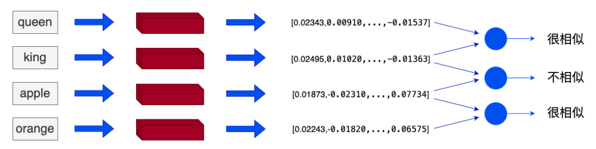
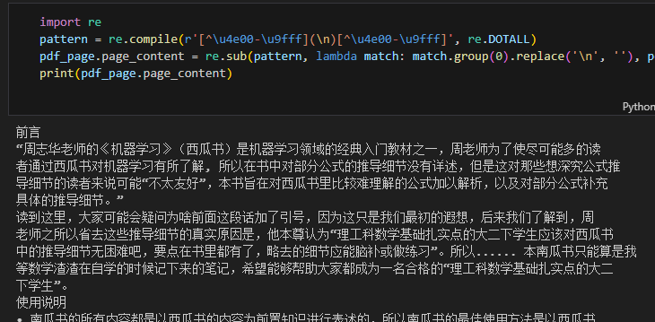
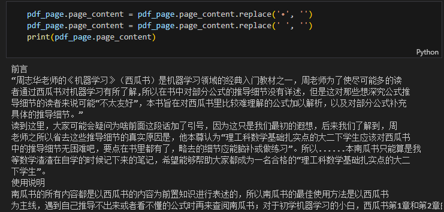

# 手把手一起学大模型应用开发💯(初级版)

***


***

## 学习参考

项目教程：[中文教程](https://datawhalechina.github.io/llm-universe/)

代码仓库：[代码地址](https://github.com/datawhalechina/llm-universe)

<font color="blue">仓库代码目录说明：</font>

>```markup
>requirements.txt：官方环境下的安装依赖
>notebook：Notebook 源代码文件
>docs：Markdown 文档文件
>figures：图片
>data_base：所使用的知识库源文件
>```


## 第三章 知识库搭建

### 项目简介

本次课程学习主要是面向小白开发者的大模型应用开发学习，旨在基于阿里云服务器，结合个人知识库助手项目，通过一个课程完成大模型开发的重点入门，主要内容包括如下的五部分内容：

1. 大模型简介，何为大模型、大模型特点是什么、LangChain 是什么，如何开发一个 LLM 应用，针对小白开发者的简单介绍；
2. 如何调用大模型 API，本节介绍了国内外知名大模型产品 API 的多种调用方式，包括调用原生 API、封装为 LangChain LLM、封装为 Fastapi 等调用方式，同时将包括百度文心、讯飞星火、智谱AI等多种大模型 API 进行了统一形式封装；
3. 知识库搭建，不同类型知识库文档的加载、处理，向量数据库的搭建；
4. 构建 RAG 应用，包括将 LLM 接入到 LangChain 构建检索问答链，使用 Streamlit 进行应用部署
5. 验证迭代，大模型开发如何实现验证迭代，一般的评估方法有什么；

本项目主要包括三部分内容：

1. LLM 开发入门。V1 版本的简化版，旨在帮助初学者最快、最便捷地入门 LLM 开发，理解 LLM 开发的一般流程，可以搭建出一个简单的 Demo。
2. LLM 开发技巧。LLM 开发更进阶的技巧，包括但不限于：Prompt Engineering、多类型源数据的处理、优化检索、召回精排、Agent 框架等
3. LLM 应用实例。引入一些成功的开源案例，从本课程的角度出发，解析这些应用范例的 Idea、核心思路、实现框架，帮助初学者明白其可以通过 LLM 开发什么样的应用。

### 项目意义

* LLM 正逐步成为信息世界的新革命力量，其通过强大的自然语言理解、自然语言生成能力，为开发者提供了新的、更强大的应用开发选择。随着国内外井喷式的 LLM API 服务开放，如何基于 LLM API 快速、便捷地开发具备更强能力、集成 LLM 的应用，开始成为开发者的一项重要技能。
* 目前，关于 LLM 的介绍以及零散的 LLM 开发技能课程已有不少，但质量参差不齐，且没有很好地整合，开发者需要搜索大量教程并阅读大量相关性不强、必要性较低的内容，才能初步掌握大模型开发的必备技能，学习效率低，学习门槛也较高。
* 本项目从实践出发，结合最常见、通用的个人知识库助手项目，深入浅出逐步拆解 LLM 开发的一般流程、步骤，旨在帮助没有算法基础的小白通过一个课程完成大模型开发的基础入门。同时，我们也会加入 RAG 开发的进阶技巧以及一些成功的 LLM 应用案例的解读，帮助完成第一部分学习的读者进一步掌握更高阶的 RAG 开发技巧，并能够通过对已有成功项目的借鉴开发自己的、好玩的应用。

***

## 3.1 基础概念

### 3.1.1 词向量

在`自然语言处理`中，首先面临的问题就是如何让模型学习文本信息，也就是如何表示一个词，输入给模型。而词向量就是这样的一个方法，可以把文本单词或短语映射到实数向量中。从概念上讲，它涉及从每个单词一维的空间到具有更低维度的连续向量空间的数学嵌入。具体来讲就是将词映射成**向量**的形式，将自然语言转换为向量之间的计算。


在自然语言处理任务中有两种常用的词表示方法：

* one-hot representation
* distribution representation

#### one-hot representation

one-hot 表示方法是把每个词表示为一个长向量。这个向量的维度是词表大小，向量中只有一个维度的值为1，其余维度为0，这个维度就代表了当前的词。 

例如：我们输入一句话“我有一个苹果”，可以拆分为['我'，'有'，'一个'，'苹果']，就可以分别用[1,0,0,0]...[0,0,0,1]来表示。


但是这种方式我们会发现存在如下几个问题：

1、每个向量之间的内积为0，也就是每个向量是互相正交的。原本上下文中存在语义关系的词汇，经过独热编码后，模型无法识别出每个词之间的关系，首先在向量表示层面就失去了原本的语义关系。


2、维度爆炸。向量的维度和文本中的词语数量相关，例子中的单词数量为4，所以我们的向量表示为1*4。但是在自然语言处理中，往往需要大量的数据，如果词库中存在10万的单词量，那每个单词的向量就表现为10万维。向量的维度过高，会导致模型的训练难度增加，难以收敛。


3、向量稀疏。通过例子我们可以发现，使用one hot 时，除了当前单词位置的值为1之外，其余位置的值都为0，这样就会带来向量值稀疏的问题，其实还是向量之间（单词）之间没有语义上的联系。

#### distribution representation

**分布式表示**最早是 Hinton 在1986年的论文[《Learning distributed representations of concepts》](https://api.semanticscholar.org/CorpusID:265039794)中提出的概念。由于传统的方法表示单词是稀疏的，但是稀疏的词表示在解决某些复杂的任务时会造成维数灾难。但是，低纬的词向量对于一些复杂的任务是没有问题的，同时也可以套用在深度学习的方法中。

分布式表示将词转化为一个**定长**（可指定）、**稠密**并且互相**存在语义关系**的向量。此处的存在语义关系可以理解为：**分布相似**的词，是具有**相同的语义**的。



例如，"king" 和 "queen" 这两个单词在嵌入空间中的位置将会非常接近，因为它们的含义相似。而 "apple" 和 "orange" 也会很接近，因为它们都是水果。而 "king" 和 "apple" 这两个单词在嵌入空间中的距离就会比较远，因为它们的含义不同。


在RAG（Retrieval Augmented Generation，检索增强生成）方面词向量的**优势**主要有两点：

* 词向量比文字更适合检索。当我们在数据库检索时，如果数据库存储的是文字，主要通过检索关键词（词法搜索）等方法找到相对匹配的数据，匹配的程度是取决于关键词的数量或者是否完全匹配查询句的；但是词向量中包含了原文本的语义信息，可以通过计算问题与数据库中数据的点积、余弦距离、欧几里得距离等指标，直接获取问题与数据在语义层面上的相似度；
* 词向量比其它媒介的综合信息能力更强，当传统数据库存储文字、声音、图像、视频等多种媒介时，很难去将上述多种媒介构建起关联与跨模态的查询方法；但是词向量却可以通过多种向量模型将多种数据映射成统一的向量形式。

### 3.1.2 向量数据库

**向量数据库**是用于高效计算和管理大量向量数据的解决方案。向量数据库是一种专门用于存储和检索向量数据（embedding）的数据库系统。它与传统的基于关系模型的数据库不同，它主要关注的是向量数据的特性和相似性。

在向量数据库中，数据被表示为向量形式，每个向量代表一个数据项。这些向量可以是数字、文本、图像或其他类型的数据。向量数据库使用高效的索引和查询算法来加速向量数据的存储和检索过程。


向量数据库中的数据以向量作为基本单位，对向量进行存储、处理及检索。向量数据库通过计算与目标向量的余弦距离、点积等获取与目标向量的**相似度**。当处理大量甚至海量的向量数据时，向量数据库索引和**查询算法**的效率明显高于传统数据库。


在搭建 RAG 系统时，我们往往可以通过使用嵌入模型来构建词向量，我们可以选择：

* 使用各个公司的 Embedding API；
* 在本地使用嵌入模型将数据构建为词向量。

#### 主流的向量数据库

* [Chroma](https://www.trychroma.com/)：是一个轻量级向量数据库，拥有丰富的功能和简单的 API，具有简单、易用、轻量的优点，但功能相对简单且不支持GPU加速，适合初学者使用。
* [Weaviate](https://weaviate.io/)：是一个开源向量数据库。除了支持相似度搜索和最大边际相关性（MMR，Maximal Marginal Relevance）搜索外还可以支持结合多种搜索算法（基于词法搜索、向量搜索）的混合搜索，从而搜索提高结果的相关性和准确性。
* [Qdrant](https://qdrant.tech/)：Qdrant使用 Rust 语言开发，有极高的检索效率和RPS（Requests Per Second），支持本地运行、部署在本地服务器及Qdrant云三种部署模式。且可以通过为页面内容和元数据制定不同的键来复用数据。

## 3.2 使用Embedding API

我们仍然基于**智谱GLM-4**调用API进行实验，首先将所需的API密钥填入.env文件中的`ZHIPUAI_API_KEY`部分。由于智谱有封装好的接口所以我们直接调用即可。

```python
from zhipuai import ZhipuAI
def zhipu_embedding(text: str):

    api_key = os.environ['ZHIPUAI_API_KEY']
    client = ZhipuAI(api_key=api_key)
    response = client.embeddings.create(
        model="embedding-2",
        input=text,
    )
    return response

text = '要生成 embedding 的输入文本，字符串形式。'
response = zhipu_embedding(text=text)
```

API返回的数据为`json`格式，除`object`向量类型外还有存放数据的`data`、embedding model 型号`model`以及本次 token 使用情况`usage`等数据，具体如下所示：

```json
{

 "object": "list",

 "data": [

  {

   "object": "embedding",

   "index": 0,

   "embedding": [

​    -0.006929283495992422,

​    ... (省略)

​    -4.547132266452536e-05,

   ],

  }

 ],

 "model": "text-embedding-3-small",

 "usage": {

  "prompt_tokens": 5,

  "total_tokens": 5

 }

}
```


我们可以调用response的object来获取embedding的类型。response为`zhipuai.types.embeddings.EmbeddingsResponded`类型，我们可以调用`object`、`data`、`model`、`usage`来查看response的embedding类型、embedding、embedding model及使用情况。

```python
print(f'response类型为：{type(response)}')
print(f'embedding类型为：{response.object}')
print(f'生成embedding的model为：{response.model}')
print(f'生成的embedding长度为：{len(response.data[0].embedding)}')
print(f'embedding（前10）为: {response.data[0].embedding[:10]}')
```


## 3.3数据处理

当我们读取了本地的文档之后需要对文档的数据进行合理的处理。

### 3.3.1 数据读取

#### .pdf文档读取

我们可以使用 `LangChain `的 `PyMuPDFLoader `来读取知识库的 PDF 文件。PyMuPDFLoader 是 PDF 解析器中速度最快的一种，结果会包含 PDF 及其页面的详细元数据，并且**每页返回一个文档**。

```python
from langchain.document_loaders.pdf import PyMuPDFLoader

# 创建一个 PyMuPDFLoader Class 实例，输入为待加载的 pdf 文档路径
loader = PyMuPDFLoader("../../data_base/knowledge_db/pumkin_book/pumpkin_book.pdf")

# 调用 PyMuPDFLoader Class 的函数 load 对 pdf 文件进行加载
pdf_pages = loader.load()
```

文档加载后储存在 `pages` 变量中:

\- `page` 的变量类型为 `List`

\- 打印 `pages` 的长度可以看到 pdf 一共包含多少页


```python
print(f"载入后的变量类型为：{type(pdf_pages)}，",  f"该 PDF 一共包含 {len(pdf_pages)} 页")
```


`page` 中的每一元素为一个文档，变量类型为 `langchain_core.documents.base.Document`, 文档变量类型包含两个属性

\- `page_content` 包含该文档的内容。

\- `meta_data` 为文档相关的描述性数据。

```python
pdf_page = pdf_pages[1]
print(f"每一个元素的类型：{type(pdf_page)}.", 
    f"该文档的描述性数据：{pdf_page.metadata}", 
    f"查看该文档的内容:\n{pdf_page.page_content}", 
    sep="\n------\n")
```


#### .md文档读取

我们可以采取完全一致的方法调用`LangChain`的`UnstructuredMarkdownLoader`来读取markdown文档：

```python
from langchain.document_loaders.markdown import UnstructuredMarkdownLoader

loader = UnstructuredMarkdownLoader("../../data_base/knowledge_db/prompt_engineering/1. 简介 Introduction.md")
md_pages = loader.load()

print(f"载入后的变量类型为：{type(md_pages)}，",  f"该 Markdown 一共包含 {len(md_pages)} 页")
```


```python
md_page = md_pages[0]
print(f"每一个元素的类型：{type(md_page)}.", 
    f"该文档的描述性数据：{md_page.metadata}", 
    f"查看该文档的内容:\n{md_page.page_content[0:][:200]}", 
    sep="\n------\n")
```


### 3.3.2 数据清洗

我们期望知识库的数据尽量是有序的、优质的、精简的，因此我们要删除低质量的、甚至影响理解的文本数据。  

可以看到上文中读取的pdf文件不仅将一句话按照原文的分行添加了换行符`\n`，也在原本两个符号中间插入了`\n`，我们可以使用正则表达式匹配并删除掉`\n`。

```python
import re
pattern = re.compile(r'[^\u4e00-\u9fff](\n)[^\u4e00-\u9fff]', re.DOTALL)
pdf_page.page_content = re.sub(pattern, lambda match: match.group(0).replace('\n', ''), pdf_page.page_content)
print(pdf_page.page_content)
```



进一步的，其中的一些空格和**·**还需要删去。

```python
pdf_page.page_content = pdf_page.page_content.replace('•', '')
pdf_page.page_content = pdf_page.page_content.replace(' ', '')
print(pdf_page.page_content)
```



同时也可以用replace来置换一些换行

```python
md_page.page_content = md_page.page_content.replace('\n\n', '\n')
print(md_page.page_content)
```

### 3.3.3 文档分割

由于单个文档的长度往往会超过模型支持的上下文，导致检索得到的知识太长超出模型的处理能力，因此，在构建向量知识库的过程中，我们往往需要对文档进行分割，将单个文档按长度或者按固定的规则分割成若干个 chunk，然后将每个 chunk 转化为词向量，存储到向量数据库中。

在检索时，我们会以 chunk 作为检索的元单位，也就是每一次检索到 k 个 chunk 作为模型可以参考来回答用户问题的知识，这个 k 是我们可以自由设定的。

Langchain 中文本分割器都根据 `chunk_size` (块大小)和 `chunk_overlap` (块与块之间的重叠大小)进行分割。


* chunk_size 指每个块包含的字符或 Token （如单词、句子等）的数量

* chunk_overlap 指两个块之间共享的字符数量，用于保持上下文的连贯性，避免分割丢失上下文信息


Langchain 提供多种文档分割方式，区别在怎么确定块与块之间的边界、块由哪些字符/token组成、以及如何测量块大小

- RecursiveCharacterTextSplitter(): 按字符串分割文本，递归地尝试按不同的分隔符进行分割文本。
- CharacterTextSplitter(): 按字符来分割文本。
- MarkdownHeaderTextSplitter(): 基于指定的标题来分割markdown 文件。
- TokenTextSplitter(): 按token来分割文本。
- SentenceTransformersTokenTextSplitter(): 按token来分割文本
- Language(): 用于 CPP、Python、Ruby、Markdown 等。
- NLTKTextSplitter(): 使用 NLTK（自然语言工具包）按句子分割文本。
- SpacyTextSplitter(): 使用 Spacy按句子的切割文本。

```python
''' 
* RecursiveCharacterTextSplitter 递归字符文本分割
RecursiveCharacterTextSplitter 将按不同的字符递归地分割(按照这个优先级["\n\n", "\n", " ", ""])，
    这样就能尽量把所有和语义相关的内容尽可能长时间地保留在同一位置
RecursiveCharacterTextSplitter需要关注的是4个参数：

* separators - 分隔符字符串数组
* chunk_size - 每个文档的字符数量限制
* chunk_overlap - 两份文档重叠区域的长度
* length_function - 长度计算函数
'''
#导入文本分割器
from langchain.text_splitter import RecursiveCharacterTextSplitter

# 知识库中单段文本长度
CHUNK_SIZE = 500

# 知识库中相邻文本重合长度
OVERLAP_SIZE = 50

# 使用递归字符文本分割器
text_splitter = RecursiveCharacterTextSplitter(
    chunk_size=CHUNK_SIZE,
    chunk_overlap=OVERLAP_SIZE
)
text_splitter.split_text(pdf_page.page_content[0:1000])

split_docs = text_splitter.split_documents(pdf_pages)
print(f"切分后的文件数量：{len(split_docs)}")

print(f"切分后的字符数（可以用来大致评估 token 数）：{sum([len(doc.page_content) for doc in split_docs])}")
```


<font color="red">注意：</font>如何对文档进行分割，其实是数据处理中最核心的一步，其往往决定了检索系统的下限。但是，如何选择分割方式，往往具有很强的业务相关性——针对不同的业务、不同的源数据，往往需要设定个性化的文档分割方式。因此，在本章，我们仅简单根据 chunk_size 对文档进行分割。对于有兴趣进一步探索的读者，欢迎阅读我们第三部分的项目示例来参考已有的项目是如何进行文档分割的。


## 3.4 搭建自己的向量数据库

Langchain 集成了超过 30 个不同的向量存储库。我们选择 Chroma 是因为它轻量级且数据存储在内存中，这使得它非常容易启动和开始使用。

LangChain 可以直接使用 OpenAI 和百度千帆的 Embedding，同时，我们也可以针对其不支持的 Embedding API 进行自定义，例如，我们可以基于 LangChain 提供的接口，封装一个 zhupuai_embedding，来将智谱的 Embedding API 接入到 LangChain 中。

我们以一篇介绍光伏电池发电的论文为例进行读取并进行展示

```python
from langchain.document_loaders.pdf import PyMuPDFLoader

# 创建一个 PyMuPDFLoader Class 实例，输入为待加载的 pdf 文档路径
loader = PyMuPDFLoader("../../data_base/knowledge_db/photovoltaic_detection_1.pdf")

# 调用 PyMuPDFLoader Class 的函数 load 对 pdf 文件进行加载
pdf_pages = loader.load()

print(f"载入后的变量类型为：{type(pdf_pages)}，",  f"该 PDF 一共包含 {len(pdf_pages)} 页")

pdf_page = pdf_pages[1]
print(f"每一个元素的类型：{type(pdf_page)}.", 
    f"该文档的描述性数据：{pdf_page.metadata}", 
    f"查看该文档的内容:\n{pdf_page.page_content}", 
    sep="\n------\n")
```


然后对文章进行切分

```python
from langchain.text_splitter import RecursiveCharacterTextSplitter

# 切分文档
text_splitter = RecursiveCharacterTextSplitter(
    chunk_size=500, chunk_overlap=50)

split_docs = text_splitter.split_documents(pdf_pages)
print(f"切分后的文件数量：{len(split_docs)}")
print(f"切分后的字符数（可以用来大致评估 token 数）：{sum([len(doc.page_content) for doc in split_docs])}")
```


然后调用智谱的 Embedding API 接入到 LangChain 中，主要定义两个函数：① embed_query 方法，用于对单个字符串（query）进行 embedding；②embed_documents 方法，用于对字符串列表（documents）进行 embedding。

```python
from __future__ import annotations

import logging
from typing import Dict, List, Any


from langchain.embeddings.base import Embeddings
from langchain.pydantic_v1 import BaseModel, root_validator

logger = logging.getLogger(__name__)

class ZhipuAIEmbeddings(BaseModel, Embeddings):
    """`Zhipuai Embeddings` embedding models."""

    client: Any
    """`zhipuai.ZhipuAI"""

    @root_validator()
    def validate_environment(cls, values: Dict) -> Dict:
        """
        实例化ZhipuAI为values["client"]

        Args:

            values (Dict): 包含配置信息的字典，必须包含 client 的字段.
        Returns:

            values (Dict): 包含配置信息的字典。如果环境中有zhipuai库，则将返回实例化的ZhipuAI类；否则将报错 'ModuleNotFoundError: No module named 'zhipuai''.
        """
        from zhipuai import ZhipuAI
        values["client"] = ZhipuAI()
        return values
    
    def embed_query(self, text: str) -> List[float]:
        """
        生成输入文本的 embedding.

        Args:
            texts (str): 要生成 embedding 的文本.

        Return:
            embeddings (List[float]): 输入文本的 embedding，一个浮点数值列表.
        """
        embeddings = self.client.embeddings.create(
            model="embedding-2",
            input=text
        )
        return embeddings.data[0].embedding
    
    def embed_documents(self, texts: List[str]) -> List[List[float]]:
        """
        生成输入文本列表的 embedding.
        Args:
            texts (List[str]): 要生成 embedding 的文本列表.

        Returns:
            List[List[float]]: 输入列表中每个文档的 embedding 列表。每个 embedding 都表示为一个浮点值列表。
        """
        return [self.embed_query(text) for text in texts]
    
  
    async def aembed_documents(self, texts: List[str]) -> List[List[float]]:
        """Asynchronous Embed search docs."""
        raise NotImplementedError("Please use `embed_documents`. Official does not support asynchronous requests")

    async def aembed_query(self, text: str) -> List[float]:
        """Asynchronous Embed query text."""
        raise NotImplementedError("Please use `aembed_query`. Official does not support asynchronous requests")
```

定义持久化路径然后进行读取

```python
# 使用 OpenAI Embedding
# from langchain.embeddings.openai import OpenAIEmbeddings
# 使用百度千帆 Embedding
# from langchain.embeddings.baidu_qianfan_endpoint import QianfanEmbeddingsEndpoint
# 使用我们自己封装的智谱 Embedding，需要将封装代码下载到本地使用
from zhipuai_embedding import ZhipuAIEmbeddings

# 定义 Embeddings
# embedding = OpenAIEmbeddings() 
embedding = ZhipuAIEmbeddings()
# embedding = QianfanEmbeddingsEndpoint()

# 定义持久化路径
persist_directory = '../../data_base/vector_db/chroma'

# !rm -rf '../../data_base/vector_db/chroma'  # 删除旧的数据库文件（如果文件夹中有文件的话），windows电脑请手动删除

from langchain.vectorstores.chroma import Chroma

vectordb = Chroma.from_documents(
    documents=split_docs[:20], # 为了速度，只选择前 20 个切分的 doc 进行生成；使用千帆时因QPS限制，建议选择前 5 个doc
    embedding=embedding,
    persist_directory=persist_directory  # 允许我们将persist_directory目录保存到磁盘上
)

vectordb.persist()

print(f"向量库中存储的数量：{vectordb._collection.count()}")
```

可以看到当前的知识库已经是我们读取的论文的前20个部分


然后我们定义一个问题并采取两种不同的检索方法进行检测：

* **相似度检索**

  Chroma的相似度搜索使用的是余弦距离，即：
  $$
  similarity = cos(A, B) = \frac{A \cdot B}{\parallel A \parallel \parallel B \parallel} = \frac{\sum_1^n a_i b_i}{\sqrt{\sum_1^n a_i^2}\sqrt{\sum_1^n b_i^2}}
  $$
  其中ai和bi分别是向量A、B的分量。

  当你需要数据库返回严谨的按余弦相似度排序的结果时可以使用`similarity_search`函数。

```python
question="defect detection"
sim_docs = vectordb.similarity_search(question,k=3)
print(f"检索到的内容数：{len(sim_docs)}")
for i, sim_doc in enumerate(sim_docs):
    print(f"检索到的第{i}个内容: \n{sim_doc.page_content[:200]}", end="\n--------------\n")
```


* **MMR检索**

  如果只考虑检索出内容的相关性会导致内容过于单一，可能丢失重要信息。

  最大边际相关性 (`MMR, Maximum marginal relevance`) 可以帮助我们在保持相关性的同时，增加内容的丰富度。

  核心思想是在已经选择了一个相关性高的文档之后，再选择一个与已选文档相关性较低但是信息丰富的文档。这样可以在保持相关性的同时，增加内容的多样性，避免过于单一的结果。

```python
mmr_docs = vectordb.max_marginal_relevance_search(question,k=3)
for i, sim_doc in enumerate(mmr_docs):
    print(f"MMR 检索到的第{i}个内容: \n{sim_doc.page_content[:200]}", end="\n--------------\n")
```

