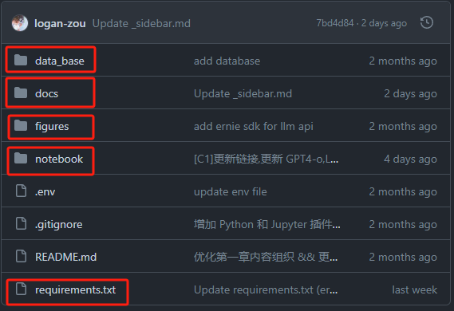

# 手把手一起学大模型应用开发💯(初级版)

***


***

## 开发环境配置

### 学习参考

项目教程：[中文教程](https://datawhalechina.github.io/llm-universe/)

代码仓库：[代码地址](https://github.com/datawhalechina/llm-universe)

<font color="blue">仓库代码目录说明：</font>

>```markup
>requirements.txt：官方环境下的安装依赖
>notebook：Notebook 源代码文件
>docs：Markdown 文档文件
>figures：图片
>data_base：所使用的知识库源文件
>```




### 项目简介

本次课程学习主要是面向小白开发者的大模型应用开发学习，旨在基于阿里云服务器，结合个人知识库助手项目，通过一个课程完成大模型开发的重点入门，主要内容包括如下的五部分内容：

1. 大模型简介，何为大模型、大模型特点是什么、LangChain 是什么，如何开发一个 LLM 应用，针对小白开发者的简单介绍；
2. 如何调用大模型 API，本节介绍了国内外知名大模型产品 API 的多种调用方式，包括调用原生 API、封装为 LangChain LLM、封装为 Fastapi 等调用方式，同时将包括百度文心、讯飞星火、智谱AI等多种大模型 API 进行了统一形式封装；
3. 知识库搭建，不同类型知识库文档的加载、处理，向量数据库的搭建；
4. 构建 RAG 应用，包括将 LLM 接入到 LangChain 构建检索问答链，使用 Streamlit 进行应用部署
5. 验证迭代，大模型开发如何实现验证迭代，一般的评估方法有什么；

本项目主要包括三部分内容：

1. LLM 开发入门。V1 版本的简化版，旨在帮助初学者最快、最便捷地入门 LLM 开发，理解 LLM 开发的一般流程，可以搭建出一个简单的 Demo。
2. LLM 开发技巧。LLM 开发更进阶的技巧，包括但不限于：Prompt Engineering、多类型源数据的处理、优化检索、召回精排、Agent 框架等
3. LLM 应用实例。引入一些成功的开源案例，从本课程的角度出发，解析这些应用范例的 Idea、核心思路、实现框架，帮助初学者明白其可以通过 LLM 开发什么样的应用。

### 项目意义

* LLM 正逐步成为信息世界的新革命力量，其通过强大的自然语言理解、自然语言生成能力，为开发者提供了新的、更强大的应用开发选择。随着国内外井喷式的 LLM API 服务开放，如何基于 LLM API 快速、便捷地开发具备更强能力、集成 LLM 的应用，开始成为开发者的一项重要技能。

* 目前，关于 LLM 的介绍以及零散的 LLM 开发技能课程已有不少，但质量参差不齐，且没有很好地整合，开发者需要搜索大量教程并阅读大量相关性不强、必要性较低的内容，才能初步掌握大模型开发的必备技能，学习效率低，学习门槛也较高。

* 本项目从实践出发，结合最常见、通用的个人知识库助手项目，深入浅出逐步拆解 LLM 开发的一般流程、步骤，旨在帮助没有算法基础的小白通过一个课程完成大模型开发的基础入门。同时，我们也会加入 RAG 开发的进阶技巧以及一些成功的 LLM 应用案例的解读，帮助完成第一部分学习的读者进一步掌握更高阶的 RAG 开发技巧，并能够通过对已有成功项目的借鉴开发自己的、好玩的应用。

  ***

## CodeSpace配置

>🔴**<font color="red">注意：</font>**首先确保能够流畅访问Github的网络环境，否则建议使用本地环境开发或者租用云服务器。

### 代码空间

`代码空间`是托管在云中的开发环境。 可通过将配置文件提交到存储库（通常称为“配置即代码”）来为 GitHub Codespaces 自定义项目，这将为项目的所有用户创建可重复的 codespace 配置。 有关详细信息，请参阅“[开发容器简介](https://docs.github.com/zh/codespaces/setting-up-your-project-for-codespaces/adding-a-dev-container-configuration/introduction-to-dev-containers)”。

### 创建Codespace

使用的详细细节在[官方文档](https://docs.github.com/en/codespaces/overview)。

具体步骤：

> 1、打开[GitHub](https://github.com/)，并完成登录
>
> 2、点击右上角头像 => 进入仓库列表 => 点击New新建一个仓库
>
> 3、创建仓库(如果涉及到一些隐私信息建议选择Private)
>
> 4、在创建好的仓库内，点击右上角的code并选择codespace，点击Create codespace on main
>
> 5、接着你就会获得一个形如VScode的界面，至此你就完成了codespace的创建


在这里你可以选择自由地进行环境的配置，例如安装conda，git clone项目等等，同时由于 GitHub 服务器在国外，无需配置国内镜像源。

### 以LLM项目为例，配置所需环境

接下来是一些针对本次课程学习项目亲测可用的环境配置：

* 新建虚拟环境(本课程项目是基于python3.10开发的)

```bash
conda create -n llm-universe python=3.10
```

* 激活虚拟环境

```bash
conda activate llm-universe
```

<font color="blue">注意：这里如果出现如下报错。</font>

`CondaError: Run conda init before conda activate`

则按照如下处理：


>* **解决措施**：
>
>  * 首先运行`conda info --envs`查看虚环境是否成功创建。
>
>  * 若虚环境存在，则先运行`conda init`并观察，若结果为`No action taken`则表示初始化已完成。
>
>  * 重新激活虚环境，如果仍然提示失败则首先观察刚刚conda init运行后的初始化文件路径中是否存在中文乱码，若存在则修改对应文件名。
>
>  * 若不包含中文乱码文件名，那么另一种可能性就是需要重启一下命令行。
>    * 1、直接关掉界面重新打开并激活虚环境
>    * 2、不关闭界面直接加载文件，运行：`source ~/.bashrc`
>
>  * 成功的标志：在运行conda activate xxx之前文件路径前面出现 (base)，并且运行激活虚环境之后文件路径前的括号中显示为该虚环境名称。

* 将项目代码克隆到当前仓库

```bash
git clone git@github.com:datawhalechina/llm-universe.git
# 如果克隆失败也可以尝试用https路径的地址
git clone https://github.com/datawhalechina/llm-universe.git
```

* 切换目录路径并安装所需要的包

```bash
cd llm-universe
pip install -r requirements.txt

# 如果是在本地进行安装可以考虑添加一些国内镜像源加速安装：
pip install -r requirements.txt -i https://pypi.tuna.tsinghua.edu.cn/simple
```

> 一些常用的国内镜像源，大家可以按需切换：
>
> 清华：https://pypi.tuna.tsinghua.edu.cn/simple/
> 阿里云：http://mirrors.aliyun.com/pypi/simple/
> 中国科技大学：https://pypi.mirrors.ustc.edu.cn/simple/
> 华中科技大学：http://pypi.hustunique.com/simple/
> 上海交通大学：https://mirror.sjtu.edu.cn/pypi/web/simple/
> 豆瓣：http://pypi.douban.com/simple

### 使用codespace的一些使用小插件

1、python插件

由于本次课程的开发是基于python语言，为了有更好的开发体验，因此可以在插件市场中下载python插件，如下图所示：


2、Jupyter插件

由于本次课程中的示例代码是存放在jupyter notebook中的，因此建议安装jupyter插件，如下图所示：


3、其他资源

**下载 NLTK 相关资源**，我们在使用开源词向量模型构建开源词向量的时候，需要用到第三方库 nltk 的一些资源。正常情况下，其会自动从互联网上下载，但可能由于网络原因会导致下载中断。当我们使用 nltk 时就会报错。此处我们从国内仓库镜像地址下载相关资源。

我们用以下命令下载 nltk 资源并解压：

```shell
cd /root
git clone https://gitee.com/yzy0612/nltk_data.git  --branch gh-pages
cd nltk_data
mv packages/*  ./
cd tokenizers
unzip punkt.zip
cd ../taggers
unzip averaged_perceptron_tagger.zip
```

## VScode远程连接Codespace

由于每次打开github进入codespace多少有点麻烦，因此我们也可以在本地的VScode中远程连接所创建的codespace。

* 打开VScode并下载codespace插件


* 在左侧的活动栏中点击远程连接功能，并选择连接方式为godespace


* 按照提示登录Github，并点击连接按钮即可完成连接


## 注意

codespace并不是永久免费的，每个月提供的免费额度是120h，超过了会收费，大家可以在github个人主页的Billing and plans找到使用情况。 


